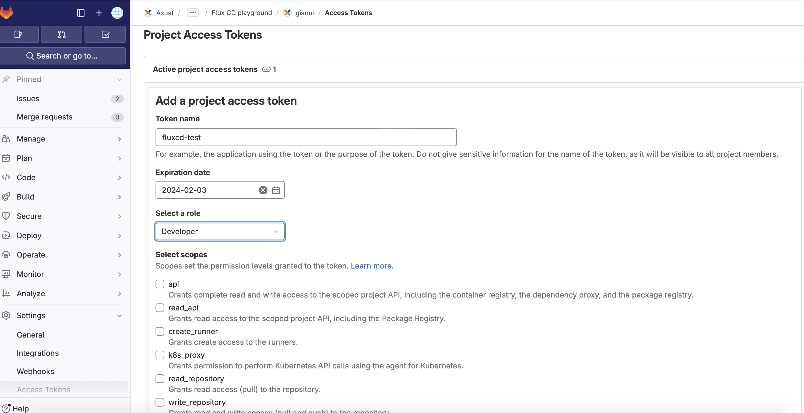
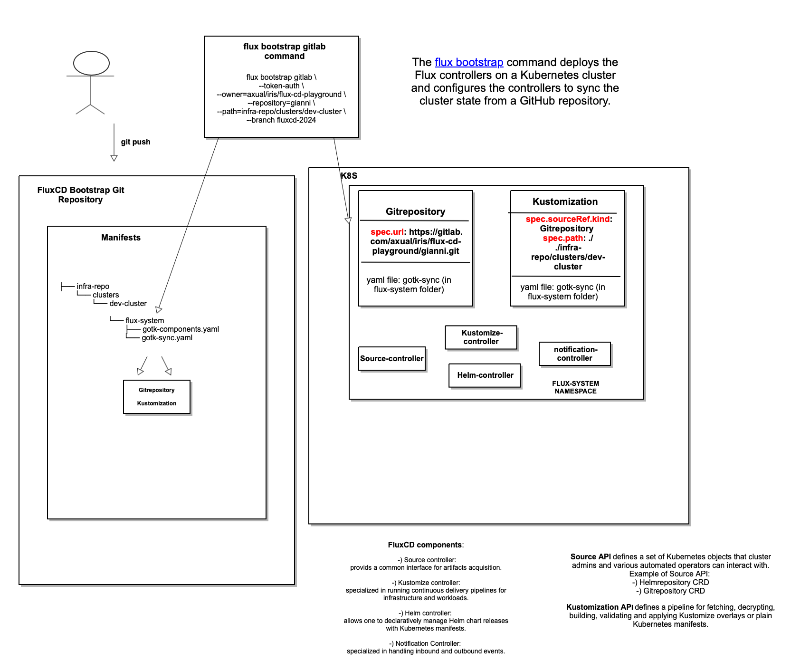
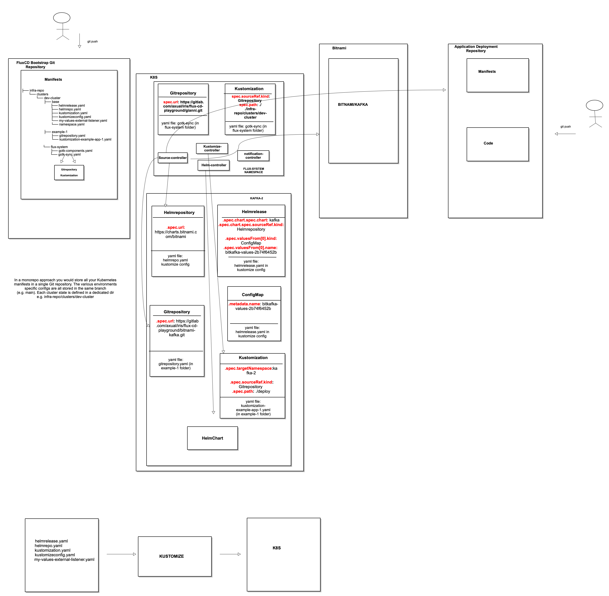

# Introduction to Flux CD v2
## Prerequisites 
* Docker Desktop
* macOS
## Get the Flux CLI on macOS


```
brew install fluxcd/tap/flux
```

Now we can run `flux --help` to see its installed configuration.

## Check the cluster

```
flux check --pre
```

## Documentation

As with every guide, we start with the documentation </br>
The [Core Concepts](https://fluxcd.io/flux/concepts/) is a good place to start. </br>

We begin by following the steps under the [bootstrap](https://fluxcd.io/flux/installation/#bootstrap) section for GitLab </br>

Create a GitLab personal access token on the repository that FluxCD will use 
with complete read/write access to the GitLab API.



</br>

Once we have a token, we can set it: 

```
export GITLAB_TOKEN=<your-token>
```

Then we can bootstrap it using the GitLab bootstrap method

```
flux bootstrap gitlab \
  --token-auth \
  --owner=axual/iris/flux-cd-playground \
  --repository=gianni \
  --path=infra-repo/clusters/dev-cluster \
  --branch fluxcd-2024

flux check

# flux manages itself using GitOps objects:
kubectl -n flux-system get GitRepository
kubectl -n flux-system get Kustomization
```

Check the source code that `flux bootstrap` created 

```
git pull origin flux-2024
```

It is recommended to store tokens in hidden files. Create an empty file .cred.sh and add the GITLAB_TOKEN to it:

```
export GITLAB_TOKEN=<your-token>
```

Run script using:
```
source .cred.sh
```
to set envirornment variable in your current shell session.

# Understanding Repository structure and bootstrap


The flux bootstrap gitlab command deploys the Flux controllers (specified the gotk-components. yaml file) on a Kubernetes cluster and configures the controllers to sync the cluster state from a GitHub repository, as specified in the gotk-sync.yaml file. Let's have a look at the file gotk-sync.yaml in the `flux-system` folder.

```
apiVersion: source.toolkit.fluxcd.io/v1
kind: GitRepository
metadata:
  name: flux-system
  namespace: flux-system
spec:
  interval: 1m0s
  ref:
    branch: fluxcd-2024
  secretRef:
    name: flux-system
  url: https://gitlab.com/axual/iris/flux-cd-playground/gianni.git
---
apiVersion: kustomize.toolkit.fluxcd.io/v1
kind: Kustomization
metadata:
  name: flux-system
  namespace: flux-system
spec:
  interval: 2m0s
  path: ./infra-repo/clusters/dev-cluster
  prune: true
  sourceRef:
    kind: GitRepository
    name: flux-system
```

The kustomization resource is configured to ensure that flux will monitor the Git repo for any changes at the specified path './infra-repo/clusters/dev-cluster' and validate them at a regular interval.

The Git repository contains the main directory and its associated subdirectories:

                                      
```
- infra-repo
   - clusters
      - dev-cluster
         - flux-system
```

The subdirectory `flux-sytem` dir contains the Flux configuration (the gotk-components.yaml and gotk-sync.yaml) for the cluster. This a monorepo approach since we store all your Kubernetes manifests in a single Git repository.



## Installing the bitnami/kakfa Helm Chart through Flux

We'll tell Flux about the Bitnami Helm chart with a HelmRepository CR representing a Flux source.

```
apiVersion: source.toolkit.fluxcd.io/v1beta2
kind: HelmRepository
metadata:
  name: bitnami-kafka
spec:
  interval: 1m0s
  url: https://charts.bitnami.com/bitnami

```


Next we'll create a HelmRelease Custom Resource locally, using custom values:

```
apiVersion: helm.toolkit.fluxcd.io/v2beta1
kind: HelmRelease
metadata:
  name: my-release
spec:
  interval: 5m
  releaseName: my-release
  chart:
    spec:
      chart: kafka
      sourceRef:
        kind: HelmRepository
        name: bitnami-kafka
      version: 26.4.3
  valuesFrom:
    - kind: ConfigMap
      name: bitkafka-values
```
Those files are stored within the ./infra-repo/clusters/dev-cluster/base/ folder (assuming that you're located on the working tree).
We will leverage the Kustomize ConfigMap generator for more efficient handling of custom values. This facilitates Helm release upgrades whenever there are changes in the encoded values. To implement this, consult the documentation provided in [ManageHelmRelease](https://fluxcd.io/flux/guides/helmreleases/) or alternatively, reference the file located at ./infra-repo/clusters/dev-cluster/base/ within the Git repository used for Flux bootstrapping. It's important to note that specifying the namespace in both Helmrepo and Helmrelease resources is unnecessary, as these resources will be deployed within the namespace defined in the Kustomize overlay. </br>

## build the example

Let's walk through the process of setting up an example application, named `example-app-1`, with its own GitHub repository for deployment. </br> 
### Create a secret for the Gitlab repository
To enable FluxCD to interact with the GitHub repository, we need to generate a GitLab personal access token with complete read/write access to the GitLab API. This token, named GITLAB_TOKEN_REPO_APP, will be utilized by FluxCD. It's recommended to store this token in a cred.sh file as follows:


```
export GITLAB_TOKEN=<your-token>
export GITLAB_USERNAME=giovanni.procida@axual.com
export GITLAB_TOKEN_REPO_APP=<your-token>

```


Now, create a secret to grant FluxCD access to the application deployment repository:

```
flux create secret git info-auth-example-1 \
    --namespace kafka-2
    --url=https://gitlab.com/axual/iris/flux-cd-playground/bitnami-kafka.git \
    --username=giovanni.procida@axual.com \
    --password=<GITLAB_TOKEN_REPO_APP> \
```

Ensure that you replace <GITLAB_TOKEN_REPO_APP> with the actual GitLab token. 

We can ask Flux to manage our application. This can be done through `Kustomization` and `Gitrepository`, similar to what we have previously done for the Helm charts:

```
apiVersion: source.toolkit.fluxcd.io/v1
kind: GitRepository
metadata:
  name: example-app-1
  namespace: kafka-2
spec:
  interval: 1m0s
  ref:
    branch: main
  url: https://gitlab.com/axual/iris/flux-cd-playground/bitnami-kafka.git
  secretRef:
    name: info-auth-example-1
```

```
apiVersion: kustomize.toolkit.fluxcd.io/v1
kind: Kustomization
metadata:
  name: example-app-1
  namespace: kafka-2
spec:
  interval: 2m
  targetNamespace: kafka-2
  path: "./deploy"
  prune: true
  sourceRef:
    kind: GitRepository
    name: example-app-1
```
Those files are stored within the ./infra-repo/clusters/dev-cluster/base/ folder (assuming that you're located on the working tree).
After that, the manifest files within the ./deploy directory in the  [GitLab repository for deployment](https://github.com/gianniprocida/deploy-repo) will be applied to the namespace specified by targetNamespace in the cluster.



## Setup an alert with Flux

We want to set up alerts on our deployments to Slack:

First, we will have to create a secret with our Slack webhook:

```
kubectl -n flux-system create secret generic slack-url \\
--from-literal=address=https://hooks.slack.com/services/YOUR/SLACK/WEBHOOK
```

You can find the Slack Webhook in the API settings of your Slack Channel.

Then, we are going to set up our notification provider:

```
apiVersion: notification.toolkit.fluxcd.io/v1beta1
kind: Provider
metadata:
  name: slack
  namespace: flux-system
spec:
  type: slack
  channel: general
  secretRef:
    name: slack-url
```


Then we create an Alert:

```
apiVersion: notification.toolkit.fluxcd.io/v1beta1
kind: Alert
metadata:
  name: on-call-webapp
  namespace: flux-system
spec:
  providerRef:
    name: slack
  eventSeverity: info
  eventSources:
    - kind: GitRepository
      name: '*'
    - kind: Kustomization
      name: '*'
      namespace: kafka-2
```

Now, we are going to make a change to our linked applications repository and see whether Flux is detecting the change and making the updates accordingly and also, whether Flux will notify us about the change.


# How to deploy this Cluster Configuration, applications included, on a different Kubernetes cluster on the same machine

If you currently have an active flux instance on your Docker desktop and wish to deploy an additional one for testing purposes, make sure to set up a new cluster. One way to achieve this is by starting a fresh Minikube cluster using the provided command:

```
minikube -p calico start --cni calico --cpus=2 --memory=8g --addons=metrics-server
```


* `-p calico`: Specifies the profile name as "calico."
* `start`: Initiates the Minikube cluster.
* `--cni calico`: Uses the Calico Container Network Interface (CNI) for networking within the cluster.
* `--cpus=2`: Allocates 2 CPUs for the Minikube virtual machine.
* `--memory=8g`: Allocates 8 gigabytes of memory for the Minikube virtual machine.
* `--addons=metrics-server`: Enables the metrics-server add-on, which provides resource usage metrics for the cluster.

Ensure you possess all the necessary access tokens, such as the one stored in 'cred.sh' as mentioned earlier. FluxCD requires access to the Git repository used to bootstrap itself and to the repositories used for deploying applications on your new cluster.
Following that, execute the boostrap command and wait for FluxCD to be installed on your cluster. Once installed, it will proceed to deploy applications on your Kubernetes cluster.

```
flux bootstrap gitlab \
  --token-auth \
  --owner=axual/iris/flux-cd-playground \
  --repository=gianni \
  --path=infra-repo/clusters/dev-cluster \
  --branch fluxcd-2024


flux check

# flux manages itself using GitOps objects:
kubectl -n flux-system get GitRepository
kubectl -n flux-system get Kustomization
```